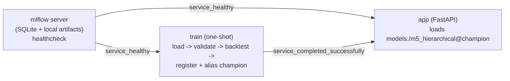

# M5 Hierarchical Forecasting POC

**Target repo:** This plan targets `CompassUOL/Hackatonicos/` as a new, currently-empty project inside the `misc` monorepo. All paths below are relative to `Hackatonicos/` unless stated otherwise.

## Overview

Build a 2-day POC that takes the raw M5 dataset extract, validates and joins it, trains and backtests a statistical baseline plus a competitive candidate model, picks the winner by an in-project WRMSSE implementation, registers it in an MLflow Model Registry, and serves 28-day hierarchical forecasts over a REST API — with MLflow tracing and structured JSON logs correlated by request id, all brought up with one command via Docker Compose. `Hackatonicos/` currently contains only the challenge spec (`m5_challenge_spec.md`); this is a greenfield build.

## Problem Frame

The origin document (`m5_challenge_spec.md`) is a full challenge spec: 30 functional requirements, 9 non-functional requirements, 14 acceptance criteria, an explicit out-of-scope list, and assumptions — written at the interface level, with only MLflow mandated and everything else (language, libraries, web framework, orchestration) left to the implementer. The goal is to prove the full path from raw files to a served, observable, reproducible model within a 2-day timebox, not to win the Kaggle leaderboard: "a pipeline that a reviewer can run, inspect, and trust, with an honest comparison against a statistical baseline."

Because the stack is open, this plan's job is to make and justify concrete architecture decisions (§ Key Technical Decisions) rather than leave them for implementation to improvise under time pressure.

## Requirements Trace

Data: R1=FR-01 (load/clean/join), R2=FR-02/03 (schema contract as code, enforced at training and inference), R3=FR-04 (intermittent-series/zero-sale rule), R4=FR-05 (missing-price rule), R5=FR-06 (documented temporal validation strategy).

Modeling: R6=FR-07 (≥2 models incl. a statistical baseline), R7=FR-08 (sliding-window backtest, no leakage), R8=FR-09 (in-project WRMSSE), R9=FR-10 (best model chosen by WRMSSE, traceable), R10=FR-11 (hierarchy coherence within tolerance).

Artifacts/reproducibility: R11=FR-12 (every run logged: params, per-level WRMSSE, model+preprocessing artifacts), R12=FR-13 (data hash, feature list, backtest windows on the run), R13=FR-14 (winner registered under a stable name, served by registry version).

API: R14=FR-15 (`POST /forecast`), R15=FR-16 (`GET /health`), R16=FR-17 (`GET /model-info`), R17=FR-18 (response names model+version), R18=FR-19 (4xx not 5xx on bad input), R19=FR-20 (unknown series/level handled cleanly).

Observability: R20=FR-21 (one trace per request), R21=FR-22 (rejected payloads traced too), R22=FR-23 (structured JSON logs w/ request id), R23=FR-24 (tracking server starts with the app, UI reachable), R24=FR-25 (live-vs-reference distribution comparison, Should).

Correctness evidence/config: R25=FR-26 (WRMSSE hand-checked), R26=FR-27 (leakage-freedom demonstrated), R27=FR-28 (config externalized), R28=FR-29 (README covers architecture/trade-offs).

Execution: R29=FR-30 (one command, clean machine, no manual steps).

Non-functional: R30=NFR-01 (reproducibility within a declared tolerance), R31=NFR-02 (no 5xx from bad input, stays up), R32=NFR-05 (one request traceable end to end by request id).

## Scope Boundaries

- Authentication, multi-tenancy, rate limiting.
- Cloud deployment, CI/CD, orchestration platforms, autoscaling, high availability — local single-command run only.
- The full M5 dataset or other competition tracks — the provided extract only.
- The M5 Uncertainty track — point forecasts only, no intervals/quantiles.
- Feature stores, data warehouses, external databases (this is also why the plan chooses SQLite over Postgres — see Key Technical Decisions).
- A user interface beyond the MLflow UI.
- Metrics backends, scrape-based monitoring, custom dashboards — MLflow runs and traces are the whole observability surface.
- Automated retraining, drift alerting, or acting on the distribution comparison — it is exposed, nothing reacts to it.
- Large-scale hyperparameter search, AutoML, or ensembling beyond picking the better of two models.
- A broad automated test suite or coverage target — only the WRMSSE hand-check and the leakage demonstration are required correctness evidence.
- MinT or other advanced hierarchical reconciliation — bottom-up only (see Key Technical Decisions).

## Context & Research

### Relevant Code and Patterns

No in-workspace precedent exists for MLflow, FastAPI, or Docker Compose anywhere in the `misc` monorepo — this project introduces all three fresh. The one genuinely transferable convention, found in sibling Python projects (`CompassUOL/TTRX`, `CompassUOL/Blacksmith`):
- `uv`-managed `pyproject.toml`, Python ≥3.12 (`TTRX/pyproject.toml`, `Blacksmith/pyproject.toml`, `Blacksmith/.python-version`).
- `pydantic-settings`-based typed config: `CompassUOL/Blacksmith/src/config.py` uses `BaseSettings` + `SettingsConfigDict(env_file=".env", ...)` — worth following for this project's config module.
- No testing/linting convention exists anywhere in the workspace to inherit (no `pytest.ini`, `ruff.toml`, `tests/` dirs in any sibling project) — this project is free to set its own.

### Institutional Learnings

No `docs/solutions/` directory exists anywhere in the `misc` monorepo (confirmed by direct search and by grepping existing `docs/plans/`, `docs/brainstorms/`, `docs/history/` directories under `TTRX`, `Blacksmith`, `SowHelper` for forecasting/MLflow/Compose/observability content — zero hits). There is no institutional precedent to draw from; standard risks are called out directly in Risks & Dependencies instead.

### External References

- MLflow Tracing is generic enough for arbitrary inference requests (not just LLM calls) via `@mlflow.trace` / `mlflow.start_span`, but has no autolog hook for a plain scikit-learn/LightGBM model — manual instrumentation is required and fully supported ([Manual Tracing](https://mlflow.org/docs/3.0.1/tracing/api/manual-instrumentation), [Tracing overview](https://mlflow.org/docs/latest/genai/tracing/)).
- The Model Registry requires a database-backed tracking store — a plain file store does not support it; SQLite is sufficient for a single-writer POC ([Backend Stores](https://mlflow.org/docs/latest/self-hosting/architecture/backend-store/)). Aliases (`@champion`) are the current recommended mechanism for "which version to serve," replacing legacy stage labels ([Model Registry Tutorial](https://mlflow.org/docs/latest/ml/model-registry/tutorial)).
- MLflow's own reference Compose stack pairs a tracking server with Postgres + MinIO ([mlflow/docker-compose](https://github.com/mlflow/mlflow/tree/master/docker-compose)) — this plan deliberately simplifies to SQLite + local filesystem given the Out-of-Scope exclusion of external databases.
- WRMSSE definition and a hand-verifiable single-series fixture, per the M5 methodology repo and a public walkthrough ([M5-methods](https://github.com/Mcompetitions/M5-methods), [WRMSSE tutorial](https://www.pmorgan.com.au/tutorials/wrmsse-for-the-m5-dataset/)): `RMSSE = sqrt(mean_squared_forecast_error / in_sample_naive_MSE)`. Fixture: train=[10,12,8,14,6] (naive-diff scale = 30), test actual=[10,20] vs forecast=[15,15] (mean squared error = 25) → `RMSSE = sqrt(25/30) ≈ 0.9129`.
- Seasonal-naive (lag-7) is the standard M5 "must-have" baseline; Croston/SBA are a worse fit because M5 demand is calendar-seasonal rather than sparse-erratic ([Nixtla CrostonSBA docs](https://nixtlaverse.nixtla.io/statsforecast/docs/models/crostonsba.html)).
- A pooled global LightGBM model (Tweedie objective) via `mlforecast`'s automated lag/rolling/calendar feature generation matches the approach that dominated the actual M5 leaderboard and is the lowest-effort path to a real accuracy edge within a 1-day budget ([mlforecast](https://github.com/Nixtla/mlforecast)).
- Bottom-up aggregation is coherent by construction and an appropriate scope-fit versus MinT, which requires estimating a full/shrunk error covariance across levels ([Panagiotelis et al., "Forecast reconciliation: a review"](https://www.sciencedirect.com/science/article/pii/S0169207023001097)).

## Key Technical Decisions

- **Python ≥3.12, `uv`-managed `pyproject.toml`**: matches the one real convention found in this workspace (TTRX, Blacksmith).
- **FastAPI for the REST layer**: no in-repo precedent either way; pydantic-native request validation gives clean 4xx handling (FR-19) and pairs well with MLflow's async trace logging.
- **MLflow backend store: SQLite (`mlflow.db`) + local filesystem artifact root, both on one Docker volume**: Model Registry requires a DB-backed store; SQLite is the simplest one that satisfies it. Postgres/MinIO (MLflow's own reference stack) is unnecessary complexity for a single-writer 2-day POC, and the spec's Out-of-Scope list explicitly excludes external databases.
- **Model version resolution: MLflow alias `champion`**, not a hardcoded version number or legacy "stage": training sets the alias on the winning run's version; the API always loads `models:/m5_hierarchical@champion` at startup, so there is no manual coordination step between training and serving.
- **Compose service graph: `mlflow` (server, healthcheck) → `train` (one-shot, `depends_on: service_healthy`) → `app` (`depends_on: service_completed_successfully` on `train`, `service_healthy` on `mlflow`)**: makes "MLflow unreachable at boot" a non-issue by construction. If `train` fails (e.g. a schema violation), `app` never starts — the correct failure mode, versus serving with no model loaded.
- **Baseline model: seasonal-naive (lag-7) via `statsforecast`**: the standard M5 "must-have" baseline; a better fit than Croston/SBA for calendar-seasonal M5 demand.
- **Candidate model: pooled global LightGBM (Tweedie objective) via `mlforecast`**, lag/rolling/calendar features: matches the standard competitive M5 approach within a 1-day implementation budget.
- **Hierarchy coherence: bottom-up aggregation, not MinT**: coherent by construction, no covariance estimation needed; MinT is noted in the README as future work, not built.
- **WRMSSE implemented from scratch** (FR-09 forbids importing it): hand-verified against the single-series fixture above, plus a second, purpose-built weighted multi-series fixture to cover the 12-level aggregation step the single-series fixture doesn't exercise.
- **AC-02 / AC-12 demonstrations are automated pytest fixtures**, not live manual edits: a shipped corrupted-CSV fixture and a shipped deliberately-overlapping backtest window are exercised by tests asserting the validator/leakage-check fires — matches AC-12's own text ("a check that never fires proves nothing") and is more demo-reliable than editing files live during a walkthrough.
- **AC-13 reproducibility demo = two full `docker compose down -v && up --build` cycles**: matches what "clean machine" actually means; requires a fixed random seed and deterministic data ordering, declared explicitly in config rather than left to chance.
- **Structured logging: stdlib `logging` + a small custom JSON `Formatter` and a `contextvar`-based request-id filter**: no need for an extra dependency (e.g. `structlog`) for something this small.
- **Observability-sink failures (a trace or log write failing) are caught and logged, never surfaced to the caller**: preserves NFR-02 ("never 5xx") — a hiccup in the observability path must not become a client-facing failure.

## Open Questions

### Resolved During Planning

- How does the service know which registry version to serve? Resolved via MLflow alias `champion`, set by the training/selection step (see Key Technical Decisions).
- What happens if the MLflow tracking server isn't ready when the app starts? Resolved by the Compose dependency graph (`service_healthy` / `service_completed_successfully` conditions) rather than app-level retry logic.
- How are AC-02 (corrupted column) and AC-12 (overlapping window) actually demonstrated? Resolved as shipped, automated pytest fixtures rather than live manual edits during the walkthrough.
- Full container rebuild vs. two training calls in one running stack for AC-13? Resolved as two full `docker compose down -v && up --build` cycles, since that is what "clean machine" implies.

### Deferred to Implementation

- Exact lag/rolling/calendar feature list for the candidate model (config-driven — implementer tunes within Unit 6's time budget).
- Exact statistical test or distance metric for the live-vs-reference distribution comparison at `/model-info` (FR-25 is a Should requirement; any reasonable comparison — e.g. mean/variance delta or a KS statistic — satisfies it).
- Precise MLflow trace attribute schema beyond the required fields (request_id, endpoint, status, duration, level) — additional attributes may be added as useful during implementation.

## Output Structure

    Hackatonicos/
    ├── docker-compose.yml
    ├── Dockerfile.app
    ├── Dockerfile.train
    ├── pyproject.toml
    ├── .env.example
    ├── config/settings.yaml
    ├── src/m5_forecast/
    │   ├── config.py
    │   ├── logging.py
    │   ├── data/
    │   │   ├── schema.py
    │   │   ├── load.py
    │   │   └── build_features.py
    │   ├── evaluation/
    │   │   ├── wrmsse.py
    │   │   └── backtest.py
    │   ├── models/
    │   │   ├── baseline.py
    │   │   ├── candidate.py
    │   │   └── reconcile.py
    │   ├── train.py
    │   └── api/
    │       ├── main.py
    │       ├── schemas.py
    │       └── tracing.py
    ├── tests/
    │   ├── fixtures/corrupted_sell_prices.csv
    │   ├── test_schema_contract.py
    │   ├── test_wrmsse.py
    │   ├── test_leakage_check.py
    │   ├── test_reconciliation.py
    │   └── test_api.py
    ├── scripts/demo.sh
    └── README.md

## High-Level Technical Design

> *This illustrates the intended approach and is directional guidance for review, not implementation specification. The implementing agent should treat it as context, not code to reproduce.*

Compose service dependency graph — this is the piece that resolves the "MLflow unreachable at boot" and "which model version to serve" ambiguities surfaced during planning:



Selection and promotion logic (directional pseudocode):

```
baseline_run, candidate_run = train_baseline(), train_candidate()
winner = min([baseline_run, candidate_run], key=lambda r: r.metrics["wrmsse_total"])
version = mlflow.register_model(winner.artifact_uri, "m5_hierarchical")
client.set_registered_model_alias("m5_hierarchical", "champion", version)
```

## Implementation Units

- [x] **Unit 1: Project & container scaffolding**

**Goal:** Stand up config, logging, and the Compose skeleton before any modeling code exists, so nothing is containerized last-minute.

**Requirements:** R23 (FR-24), R27 (FR-28), R29 (FR-30)

**Dependencies:** None

**Files:**
- Create: `pyproject.toml`, `.env.example`, `config/settings.yaml`
- Create: `src/m5_forecast/config.py`, `src/m5_forecast/logging.py`
- Create: `docker-compose.yml`, `Dockerfile.app`, `Dockerfile.train`

**Approach:**
- `config.py`: `pydantic-settings` `BaseSettings` loading `.env` + `settings.yaml`, covering horizon (28), random seed, backtest window count/step, hierarchy-weight lookback (28 days), reproducibility tolerance, MLflow tracking URI, registered model name, alias name (`champion`), lag/rolling feature list.
- `logging.py`: stdlib `logging` + a JSON `Formatter`; a `contextvar` holds the current request id so log records and responses share it without threading it through every call.
- `docker-compose.yml`: three services per the dependency graph above — `mlflow` (backend store `sqlite:////data/mlflow.db`, artifact root `/data/artifacts`, both on a named volume, healthcheck hitting its `/health` or `/version` endpoint), `train` (env `MLFLOW_TRACKING_URI=http://mlflow:5000`), `app` (same env, port-mapped, `depends_on` both conditions above).

**Patterns to follow:**
- `CompassUOL/Blacksmith/src/config.py` — `pydantic-settings` with `SettingsConfigDict(env_file=".env", ...)`.

**Test scenarios:**
- Test expectation: none -- scaffolding and config wiring, no behavioral logic yet. Config values are exercised indirectly by every later unit's tests.

**Verification:**
- `docker compose up --build` brings up `mlflow` reachable at its documented port with an empty registry; `docker compose config` shows `train`/`app` with the correct env and `depends_on` conditions.

---

- [x] **Unit 2: Data ingestion, schema contract, modelling table**

**Goal:** Load, validate, and join `sales`/`calendar`/`sell_prices` into one modelling table, with documented, enforced rules for intermittent series and missing prices.

**Requirements:** R1 (FR-01), R2 (FR-02/03), R3 (FR-04), R4 (FR-05), R5 (FR-06)

**Dependencies:** Unit 1

**Files:**
- Create: `src/m5_forecast/data/schema.py`, `src/m5_forecast/data/load.py`, `src/m5_forecast/data/build_features.py`
- Test: `tests/test_schema_contract.py`, `tests/fixtures/corrupted_sell_prices.csv`

**Approach:**
- `schema.py` declares column types/ranges/allowed-nulls as code (e.g. via `pandera`) for `sales`, `calendar`, `sell_prices` — the same schema objects run at training and at any future raw-data touch point (FR-03).
- Zero-sale days are retained, not dropped (a series's own history starts at its first non-zero day per the WRMSSE spec, not at zero-filtering) — this rule and the missing-sell-price handling rule are both written down in the README (Unit 9), not just implied by code.
- `build_features.py` produces the joined modelling table keyed by item/store/date, carrying enough columns to derive item→store→state→total hierarchy membership.

**Patterns to follow:** None in-repo (greenfield) — `pandera`'s own schema-validation error-message shape supports the "names the column and the rule" requirement (FR-03/AC-02).

**Test scenarios:**
- Happy path: valid synthetic `sales`/`calendar`/`sell_prices` frames join into the expected modelling-table shape and hierarchy columns.
- Edge case: an item-store series that is all-zero across its full history is retained (not dropped) in the modelling table.
- Edge case: a week with a missing `sell_price` for one item-store is handled per the documented rule (assert the specific, documented behavior — e.g. excluded from price-dependent features but the sales row itself is kept).
- Error path: a corrupted column (wrong dtype, negative price, out-of-range value) fails schema validation with a message naming the column and the violated rule, not a raw library stack trace (AC-02).

**Verification:**
- `pytest tests/test_schema_contract.py` passes; running the pipeline against `tests/fixtures/corrupted_sell_prices.csv` reproduces the exact AC-02 failure-message shape.

---

- [x] **Unit 3: WRMSSE metric implementation + hand-verified fixtures**

**Goal:** Implement WRMSSE from scratch and prove it correct on fixtures small enough to hand-check.

**Requirements:** R8 (FR-09), R25 (FR-26)

**Dependencies:** Unit 1

**Files:**
- Create: `src/m5_forecast/evaluation/wrmsse.py`
- Test: `tests/test_wrmsse.py`

**Approach:**
- Pure-numpy `rmsse(actual, forecast, train_history)` per the standard M5 definition: numerator is mean squared forecast error over the horizon, denominator is the in-sample one-step-naive MSE over training history.
- `wrmsse(...)` aggregates per-series RMSSE across the 12 M5 hierarchy levels, weighting series within a level by their share of trailing-28-day dollar sales, then averages with equal weight per level.
- No forecasting-metrics library is imported for this — it is the one thing the spec requires be implemented in-project (FR-09).

**Technical design:** *(directional guidance, not implementation specification)*
```
for level in HIERARCHY_LEVELS:
    for series in level.series:
        weight[series] = trailing_28d_dollar_sales[series] / level.total_dollar_sales
        rmsse[series] = rmsse(actual[series], forecast[series], history[series])
    level_score = sum(weight[series] * rmsse[series] for series in level.series)
wrmsse = mean(level_score for level in HIERARCHY_LEVELS)  # equal weight per level
```

**Patterns to follow:** None in-repo — keep inline comments minimal (no rationale essays); put the hand-derivation walkthrough for the fixtures in `README.md`, not in code comments.

**Test scenarios:**
- Happy path: single-series RMSSE hand fixture — train=[10,12,8,14,6], test actual=[10,20], forecast=[15,15] → assert `rmsse ≈ 0.9129` to 4dp (AC-11/FR-26).
- Edge case: a second, purpose-built 2-series weighted fixture with hand-computed weights, to validate the level-aggregation/weighting step (the single-series fixture above doesn't exercise this).
- Edge case: a series with zero-variance training history (constant demand) — assert the documented divide-by-zero guard behavior rather than a silent NaN/crash.
- Error path: mismatched `actual`/`forecast` lengths raises a clear error.

**Verification:**
- `pytest tests/test_wrmsse.py` passes, asserting the literal hand-computed constants from both fixtures.

---

- [x] **Unit 4: Sliding-window backtest harness + leakage check**

**Goal:** Generate rolling-origin backtest windows and prove, with a check that can actually fire, that no window leaks future data into training.

**Requirements:** R7 (FR-08), R26 (FR-27)

**Dependencies:** Unit 2 (needs the modelling table's date range)

**Files:**
- Create: `src/m5_forecast/evaluation/backtest.py`
- Test: `tests/test_leakage_check.py`

**Approach:**
- Rolling-origin window generator: fixed step equal to the horizon (28 days), a configured number of windows, no shuffling.
- `leakage_check(windows)` is a pure function asserting `train_end < test_start` for every window (and, where features are involved, that lag/rolling features at each origin reference only data at or before that origin) — raises with a specific message identifying the offending window on violation.

**Test scenarios:**
- Happy path: N valid, non-overlapping rolling windows generated from a date range; `leakage_check` passes them all.
- Error path / Integration: a deliberately-overlapping window (test start ≤ train end) is fed to `leakage_check`, which raises — this is the fixture AC-12 demonstrates against ("a check that never fires proves nothing").
- Edge case: requesting more windows than the available history supports fails loudly rather than silently truncating.

**Verification:**
- `pytest tests/test_leakage_check.py` passes, including the case that intentionally triggers the check.

---

- [x] **Unit 5: Baseline model — seasonal naive, logged to MLflow**

**Goal:** Train, backtest, and log the mandatory statistical baseline as a complete MLflow run.

**Requirements:** R6 (FR-07, baseline half), R11 (FR-12), R12 (FR-13)

**Dependencies:** Units 2, 3, 4

**Files:**
- Create: `src/m5_forecast/models/baseline.py`
- Modify: `src/m5_forecast/train.py` (orchestration entrypoint, built out incrementally across Units 5–6)

**Approach:**
- `statsforecast`'s seasonal-naive (`season_length=7`) forecaster, run per series per backtest window from Unit 4; per-level WRMSSE from Unit 3 computed and logged as separate MLflow metrics (e.g. `wrmsse_item`, `wrmsse_store`, ..., `wrmsse_total`).
- One MLflow run per training invocation, tagged `model_type=baseline`, carrying: params (season length, window config), the input-data hash, the feature list (trivial for the baseline), and the backtest windows as a tag/artifact; model + trivial preprocessing logged as a `pyfunc`-compatible artifact so it loads the same way the candidate does later.

**Test scenarios:**
- Integration: training against a small synthetic dataset produces exactly one MLflow run with all expected metric keys and tag keys present (verified via `MlflowClient`).

**Verification:**
- `mlflow.search_runs` shows one run tagged `model_type=baseline` with per-level WRMSSE metrics and a data-hash tag populated.

---

- [x] **Unit 6: Candidate model, hierarchy coherence, selection & registry promotion**

**Goal:** Train the competitive candidate, enforce hierarchy coherence, and promote the better of the two models into the Model Registry under the `champion` alias.

**Requirements:** R6 (FR-07, candidate half), R9 (FR-10), R10 (FR-11), R13 (FR-14)

**Dependencies:** Units 2, 3, 4, 5

**Files:**
- Create: `src/m5_forecast/models/candidate.py`, `src/m5_forecast/models/reconcile.py`
- Modify: `src/m5_forecast/train.py` (selection + promotion logic)

**Approach:**
- `mlforecast` + LightGBM (Tweedie objective) as a single pooled global model across item-store series, using the lag/rolling/calendar feature list from config; same backtest+WRMSSE flow as the baseline, logged as its own MLflow run tagged `model_type=candidate`.
- `reconcile.py` sums item-store forecasts up to store/state/total (bottom-up) and asserts coherence within `numpy.isclose(atol=1e-6, rtol=1e-6)` — no MinT.
- Selection logic in `train.py` compares the two runs' WRMSSE at a declared comparison level (e.g. total), registers the winning run's model under the registry name (e.g. `m5_hierarchical`), and sets the `champion` alias on that version via `MlflowClient.set_registered_model_alias` — this must work correctly regardless of which model actually wins, not assume the candidate always wins.

**Technical design:** *(directional guidance, not implementation specification, duplicated from the High-Level Technical Design section for local context)*
```
baseline_run, candidate_run = train_baseline(), train_candidate()
winner = min([baseline_run, candidate_run], key=lambda r: r.metrics["wrmsse_total"])
version = mlflow.register_model(winner.artifact_uri, "m5_hierarchical")
client.set_registered_model_alias("m5_hierarchical", "champion", version)
```

**Patterns to follow:** None in-repo — Nixtla `mlforecast` docs for the pooled-training feature pipeline.

**Test scenarios:**
- Happy path: candidate trained on synthetic multi-series data produces forecasts and an MLflow run with per-level WRMSSE.
- Edge case: summed item-level forecasts equal the store/state/total forecasts served for those levels within tolerance (AC-05) — unit test on `reconcile.py` with synthetic numbers.
- Integration: after both runs exist, selection logic registers a model version and sets `champion` on the lower-WRMSSE run — tested in both directions (baseline wins / candidate wins) so the logic isn't hardcoded to prefer one model (AC-14).

**Verification:**
- The Model Registry shows the registered model with the `champion` alias on the better-scoring version; per-level WRMSSE for both baseline and candidate is visible in their respective runs.

---

- [x] **Unit 7: FastAPI service — endpoints & startup model loading**

**Goal:** Serve `/forecast`, `/health`, `/model-info` per the spec's API contract, loading the registered `champion` version at startup.

**Requirements:** R14 (FR-15), R15 (FR-16), R16 (FR-17), R17 (FR-18), R18 (FR-19), R19 (FR-20), R24 (FR-25)

**Dependencies:** Unit 6

**Files:**
- Create: `src/m5_forecast/api/main.py`, `src/m5_forecast/api/schemas.py`

**Approach:**
- At startup, `mlflow.pyfunc.load_model("models:/m5_hierarchical@champion")`. If this fails, the app fails fast (crashes rather than serving with no model) — Compose's dependency graph (Unit 1) already guarantees a champion exists by the time `app` starts, so a load failure here is a real misconfiguration that should be visible, not masked.
- `POST /forecast` validates the request body via pydantic (series-id or hierarchy-level form); unknown series/level resolves to a handled 404/400, never a 500 (FR-19/20).
- `GET /model-info` returns registry name/version, source run id, training window, features, per-level WRMSSE, and the reference forecast distribution — all pulled from the champion run's metrics/tags/artifacts and cached at startup rather than re-queried from MLflow on every call. The live-vs-reference distribution comparison (FR-25) is computed here against recent served forecasts.
- `GET /health` returns `{"status": "ok"}`.

**Test scenarios:**
- Happy path: `POST /forecast` with a valid `item_store` series id returns 200, 28 dated values, and the correct model name/version (AC-03).
- Happy path: `POST /forecast` with `level: state, key: CA` returns 200 and 28 values for that aggregate (AC-04).
- Happy path: `GET /model-info` returns all documented fields (AC-09).
- Happy path: `GET /health` returns 200 `{"status": "ok"}`.
- Error path: a malformed payload (missing field, wrong type) returns 400 with an actionable message, and logs show no 5xx (AC-06).
- Error path: an unknown series id returns a handled error, and `/health` still reports ok afterward (AC-07).

**Verification:**
- `pytest tests/test_api.py` passes against a stubbed loaded model; a manual `curl` walkthrough against the running Compose stack matches the documented JSON contract in the spec's section 2.1.

---

- [x] **Unit 8: Request tracing + structured logging correlation**

**Goal:** One MLflow trace per request (including rejected ones), correlated end to end with a JSON log line and the response, by request id.

**Requirements:** R20 (FR-21), R21 (FR-22), R22 (FR-23), R23 (FR-24)

**Dependencies:** Unit 7

**Execution note:** Manual `@mlflow.trace` instrumentation is required here — research confirmed MLflow's autolog integrations target LLM/agent frameworks, not plain scikit-learn/LightGBM inference, so budget this unit its own focused time rather than expecting it to be free from autolog.

**Files:**
- Create: `src/m5_forecast/api/tracing.py`
- Modify: `src/m5_forecast/api/main.py` (wire in middleware)

**Approach:**
- Middleware generates a `request_id` (`uuid4`) per request, stores it in the Unit-1 contextvar, and includes it in the response body.
- The handler is wrapped with `@mlflow.trace` (or `mlflow.start_span`), with `mlflow.update_current_trace(tags={"request_id": ..., "endpoint": ..., "level": ...})` and status/duration attributes.
- Rejected payloads still open a trace, tagged `status=rejected` with the rejection reason, so refused traffic is visible (FR-22) rather than silently dropped.
- Trace/log emission is wrapped so a failure there (e.g. tracking server briefly unreachable) is caught and logged, never surfaced to the caller as a 5xx.

**Test scenarios:**
- Happy path: a forecast response's `request_id` matches the `request_id` in the corresponding JSON log line.
- Integration: a forecast request produces exactly one MLflow trace (queryable via `MlflowClient.search_traces`) carrying request id, endpoint, status, duration, and level — this needs the live Compose stack, not a mocked unit test; call this out as a manual/demo-script verification step rather than faking it with a stub (AC-08, AC-10).
- Integration: a rejected payload also produces a trace tagged with its rejection reason (FR-22, AC-08).
- Error path: if the MLflow tracking server is unreachable when a trace write is attempted, the forecast response still returns successfully.

**Verification:**
- Manual walkthrough: call `/forecast`, take the returned `request_id`, find it in the JSON logs and in the MLflow UI's trace view — all three agree (AC-10).

---

- [x] **Unit 9: README, reproducibility demonstration, demo script**

**Goal:** Document the architecture and trade-offs, and prove two clean-container runs reproduce within the declared tolerance.

**Requirements:** R28 (FR-29), R30 (NFR-01)

**Dependencies:** All prior units

**Files:**
- Create: `README.md`, `scripts/demo.sh`

**Approach:**
- README covers: why bottom-up reconciliation instead of MinT, why SQLite instead of Postgres/MinIO, why LightGBM+`mlforecast` over classical statistical models, the documented zero-sales/missing-price rules (FR-04/05), the temporal-validation rationale (FR-06), the declared reproducibility tolerance (NFR-01), and the WRMSSE hand-derivation walkthrough (moved here rather than left as code comments, per Unit 3).
- `demo.sh` scripts the acceptance-criteria walkthrough: two full `docker compose down -v && docker compose up --build` cycles from a clean state, a diff of the two runs' WRMSSE metrics/data-hash tags via the MLflow API, a few `/forecast` calls plus one deliberately bad payload, and pointers to the MLflow UI.

**Test scenarios:**
- Test expectation: none -- documentation and a demo script, not testable application behavior. The unit's own verification (below) is the reproducibility proof itself.

**Verification:**
- Two full clean-container runs produce MLflow runs whose per-level WRMSSE is identical or within the declared tolerance, with matching data-hash tags (AC-13); `scripts/demo.sh` runs top to bottom with no manual intervention.

## System-Wide Impact

- **Interaction graph:** Compose dependency chain `mlflow → train → app`; the API's startup model-load depends entirely on state `train` wrote to the registry — there is no other coupling path.
- **Error propagation:** Schema violations fail loudly at train time (non-zero exit, Compose shows the failure) and correctly block `app` from starting. All API-layer errors resolve to 4xx; observability-sink failures (trace/log writes) are caught and logged, never propagated as 5xx.
- **State lifecycle risks:** A `train` run that crashes mid-way must not leave a `champion` alias pointing at a partial/no model — verify no alias is set until selection completes successfully, so a failed `train` leaves the stack down (correct) rather than serving a stale model.
- **Integration coverage:** End-to-end trace correlation (Unit 8) and reproducibility (Unit 9) can only be proven against a live Compose stack, not pure unit tests with mocks — each relevant unit calls this out explicitly rather than treating mocked coverage as equivalent.

## Risks & Dependencies

| Risk | Mitigation |
|------|------------|
| MLflow Tracing has no autolog hook for plain LightGBM/statsforecast models — manual instrumentation is more work than autolog-based tracing | Budget Unit 8 as its own explicit unit on Day 2 afternoon (matches the spec's own suggested plan); manual `@mlflow.trace` is confirmed fully supported, just not automatic. |
| LightGBM + `mlforecast` feature engineering could eat into the 1-day candidate-model budget | Time-box the feature set to what's specified in Unit 6; fall back to a `statsforecast` AutoETS/AutoARIMA candidate if LightGBM isn't converging by midday Day 2 — selection logic in Unit 6 doesn't care which model wins. |
| Two-clean-container reproducibility (AC-13) surfaces Compose/config drift only very late if untested until Day 2 | Unit 1's Compose skeleton should be smoke-tested (`up --build`, `down -v`, `up --build` again) as soon as it exists, not only during Unit 9. |
| Full 12-level WRMSSE weighting is easy to get subtly wrong beyond a single-series fixture | Unit 3 requires a second, purpose-built weighted multi-series fixture in addition to the single-series RMSSE fixture from research. |
| SQLite backend store under concurrent access | The `train`-then-`app` Compose ordering (Unit 1) is single-writer-then-reader by construction, so this is a documented constraint (in README, Unit 9) rather than a runtime problem. |

## Documentation / Operational Notes

- README (Unit 9) is the only documentation deliverable; no separate runbook is needed given the Out-of-Scope exclusion of CI/CD and cloud deployment.
- The MLflow UI (reachable at the documented Compose port) is the entire observability front end — no additional dashboard work is in scope.

## Sources & References

- **Origin document:** [CompassUOL/Hackatonicos/m5_challenge_spec.md](../../m5_challenge_spec.md)
- MLflow docs: [Manual Tracing](https://mlflow.org/docs/3.0.1/tracing/api/manual-instrumentation), [Tracing overview](https://mlflow.org/docs/latest/genai/tracing/), [Model Registry tutorial](https://mlflow.org/docs/latest/ml/model-registry/tutorial), [Backend Stores](https://mlflow.org/docs/latest/self-hosting/architecture/backend-store/), [reference Compose stack](https://github.com/mlflow/mlflow/tree/master/docker-compose)
- M5 methodology: [M5-methods](https://github.com/Mcompetitions/M5-methods), [WRMSSE walkthrough](https://www.pmorgan.com.au/tutorials/wrmsse-for-the-m5-dataset/)
- Nixtla docs: [statsforecast CrostonSBA](https://nixtlaverse.nixtla.io/statsforecast/docs/models/crostonsba.html), [mlforecast](https://github.com/Nixtla/mlforecast)
- Reconciliation: [Panagiotelis et al., "Forecast reconciliation: a review"](https://www.sciencedirect.com/science/article/pii/S0169207023001097)
- In-workspace convention reference: `CompassUOL/Blacksmith/src/config.py` (pydantic-settings pattern)
